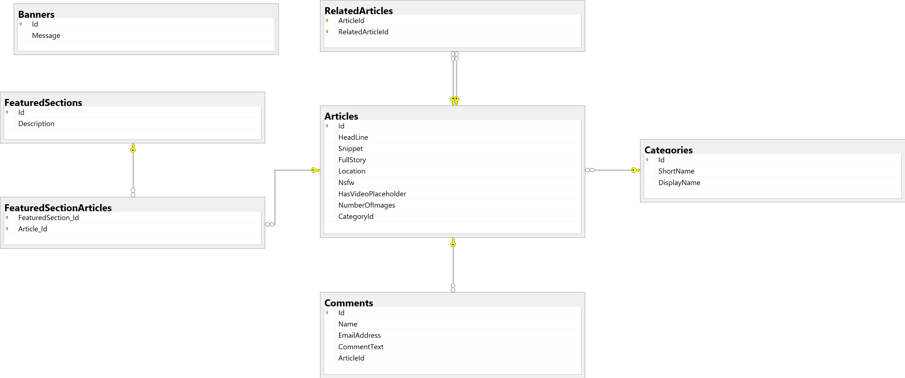

# Assignment 1: News API

This assignment is designed to allow the developer to become familiar with the tools necessary for development of an ASP.NET Core WebAPI solution.

The application must do the following:

* The application should use the Entity Framework Core 2.0 ORM, Code-First approach.
* The application's database should match the schema represented by the diagram from the appendix.
* The API should implement all the resources from the swagger document from the appendix below.
* All operations from the swagger page should work as described.
* The API should implement validation for any input fields.
* The application should "seed" data for all tables.

### Assignment Objectives

* POCO Model Creation
* DataContext Creation
* Basic WebAPI resources
* Swagger generation
* Entity relationships
* Basic CRUD operations
* REST principles

### Recommended Tools

* Visual Studio 2017
* SQL Server/MySQL/SqLite LocalDB
* Pluralsight - Fill out request for access [here](https://captechventuresinc.sharepoint.com/sites/Training/pluralsight/Lists/Access%20Request/AllItems.aspx).

### Resources

* [Entity Framework Tutorial](http://www.entityframeworktutorial.net/efcore/entity-framework-core-tutorial.aspx) is an excellent source of information on Entity Framework Code-First
* Swashbuckle documentation can be found [here](https://github.com/domaindrivendev/Swashbuckle). 
* ASP.NET Core WebAPI documentation can be found [here](https://docs.microsoft.com/en-us/aspnet/core/).
* Pluralsight Videos:
  * [ASP.NET Core Fundamentals](hhttps://app.pluralsight.com/library/courses/aspdotnet-core-fundamentals)
  * [Getting Started with Entity Framework Core 2](https://app.pluralsight.com/library/courses/entity-framework-core-2-getting-started)
  * [Best Practices in ASP.NET: Entities, Validation, and View Models](https://www.pluralsight.com/courses/aspdotnet-bestpractices-models)

### CapTech Resources

* Nick Cipollina
* John Brown
* Maddie Stigler
* Sean Burns

### Deliverables

A WebAPI that will meet the requirements listed above.  The application should create the database and schema upon start.  The Swagger page should list all available operations with relevant documentation.  All operations should be callable and work as described.

## Git Workflow

* Push all commits to the `develop` branch of this repository.  
* When you have completed the assignment, make a merge request from the GitLab portal.
* When the grader merges your code into the `master` branch, your assignment is **Complete**.

## Appendix

### Database Diagram

Below is a database diagram that is to be used for creating the Code-First Data model.



### Swagger

Below is the swagger document that is to be used for creating the API.

```javascript
{
  "swagger": "2.0",
  "info": {
    "version": "v1",
    "title": "NewsAPI",
    "description": "The CapTech Tech Challenges News API",
    "contact": {
      "name": "Nick Cipollina",
      "url": "http://www.captechconsulting.com",
      "email": "ncipollina@captechconsulting.com"
    }
  },
  "host": "localhost:28140",
  "schemes": [ "http" ],
  "paths": {
    "/api/Articles/{id}/Comments/{pageNumber}/{pageSize}": {
      "get": {
        "tags": [ "Articles" ],
        "summary": "Gets the comments for article.",
        "description": "Gets the paginated list of comments for the article.",
        "operationId": "Articles_GetCommentsForArticle",
        "consumes": [],
        "produces": [ "application/json", "text/json", "application/xml", "text/xml" ],
        "parameters": [
          {
            "name": "id",
            "in": "path",
            "description": "The article id.",
            "required": true,
            "type": "integer",
            "format": "int32"
          },
          {
            "name": "pageNumber",
            "in": "path",
            "description": "The page number.",
            "required": true,
            "type": "integer",
            "format": "int32"
          },
          {
            "name": "pageSize",
            "in": "path",
            "description": "Size of the page.",
            "required": true,
            "type": "integer",
            "format": "int32"
          }
        ],
        "responses": {
          "200": {
            "description": "",
            "schema": {
              "type": "array",
              "items": { "$ref": "#/definitions/CommentViewModel" }
            }
          },
          "404": { "description": "Article not found" }
        }
      }
    },
    "/api/Articles": {
      "get": {
        "tags": [ "Articles" ],
        "summary": "Gets all articles.",
        "description": "Get a list of all articles",
        "operationId": "Articles_GetArticles",
        "consumes": [],
        "produces": [ "application/json", "text/json", "application/xml", "text/xml" ],
        "responses": {
          "200": {
            "description": "",
            "schema": {
              "type": "array",
              "items": { "$ref": "#/definitions/ArticleViewModel" }
            }
          }
        }
      }
    },
    "/api/Articles/{id}": {
      "get": {
        "tags": [ "Articles" ],
        "summary": "Gets article by id.",
        "description": "Gets the specified article by id",
        "operationId": "Articles_GetArticle",
        "consumes": [],
        "produces": [ "application/json", "text/json", "application/xml", "text/xml" ],
        "parameters": [
          {
            "name": "id",
            "in": "path",
            "description": "The article id",
            "required": true,
            "type": "integer",
            "format": "int32"
          }
        ],
        "responses": {
          "200": {
            "description": "",
            "schema": { "$ref": "#/definitions/ArticleViewModel" }
          },
          "404": { "description": "Article not found" }
        }
      }
    },
    "/api/Banners": {
      "get": {
        "tags": [ "Banners" ],
        "summary": "Gets all banners.",
        "description": "Get a list of all banners.  This is used for the home page.",
        "operationId": "Banners_GetBanners",
        "consumes": [],
        "produces": [ "application/json", "text/json", "application/xml", "text/xml" ],
        "responses": {
          "200": {
            "description": "",
            "schema": {
              "type": "array",
              "items": { "$ref": "#/definitions/BannerViewModel" }
            }
          },
          "500": { "description": "Server Error" }
        }
      }
    },
    "/api/Banners/{id}": {
      "get": {
        "tags": [ "Banners" ],
        "summary": "Gets banner by id.",
        "description": "Gets the specified banner by id.",
        "operationId": "Banners_GetBanner",
        "consumes": [],
        "produces": [ "application/json", "text/json", "application/xml", "text/xml" ],
        "parameters": [
          {
            "name": "id",
            "in": "path",
            "description": "The banner id.",
            "required": true,
            "type": "integer",
            "format": "int32"
          }
        ],
        "responses": {
          "200": {
            "description": "",
            "schema": { "$ref": "#/definitions/BannerViewModel" }
          },
          "404": { "description": "Not Found" },
          "500": { "description": "Server Error" }
        }
      }
    },
    "/api/Categories/{id}/Articles": {
      "get": {
        "tags": [ "Categories" ],
        "summary": "Gets the articles for specified category.",
        "description": "Gets a list of all articles for the specified category.",
        "operationId": "Categories_GetArticlesForCategory",
        "consumes": [],
        "produces": [ "application/json", "text/json", "application/xml", "text/xml" ],
        "parameters": [
          {
            "name": "id",
            "in": "path",
            "description": "The category id.",
            "required": true,
            "type": "integer",
            "format": "int32"
          }
        ],
        "responses": {
          "200": {
            "description": "",
            "schema": {
              "type": "array",
              "items": { "$ref": "#/definitions/Article" }
            }
          },
          "404": { "description": "Category not found" },
          "500": { "description": "Server Error" }
        }
      }
    },
    "/api/Categories": {
      "get": {
        "tags": [ "Categories" ],
        "summary": "Gets all categories.",
        "description": "Gets a list of all categories.",
        "operationId": "Categories_GetCategories",
        "consumes": [],
        "produces": [ "application/json", "text/json", "application/xml", "text/xml" ],
        "responses": {
          "200": {
            "description": "",
            "schema": {
              "type": "array",
              "items": { "$ref": "#/definitions/CategoryViewModel" }
            }
          }
        }
      }
    },
    "/api/Categories/{id}": {
      "get": {
        "tags": [ "Categories" ],
        "summary": "Gets category by id.",
        "description": "Gets the specified category by id.",
        "operationId": "Categories_GetCategory",
        "consumes": [],
        "produces": [ "application/json", "text/json", "application/xml", "text/xml" ],
        "parameters": [
          {
            "name": "id",
            "in": "path",
            "description": "The category id.",
            "required": true,
            "type": "integer",
            "format": "int32"
          }
        ],
        "responses": {
          "200": {
            "description": "",
            "schema": { "$ref": "#/definitions/CategoryViewModel" }
          },
          "404": { "description": "Category not found" },
          "500": { "description": "Server Error" }
        }
      }
    },
    "/api/Comments/{id}": {
      "get": {
        "tags": [ "Comments" ],
        "summary": "Gets comment by id",
        "description": "Gets all comments for specified article",
        "operationId": "Comments_GetComment",
        "consumes": [],
        "produces": [ "application/json", "text/json", "application/xml", "text/xml" ],
        "parameters": [
          {
            "name": "id",
            "in": "path",
            "description": "The comment id.",
            "required": true,
            "type": "integer",
            "format": "int32"
          }
        ],
        "responses": {
          "200": {
            "description": "",
            "schema": { "$ref": "#/definitions/CommentViewModel" }
          },
          "404": { "description": "Comment not found" }
        }
      },
      "put": {
        "tags": [ "Comments" ],
        "summary": "Updates the comment",
        "description": "Updates the comment",
        "operationId": "Comments_PutComment",
        "consumes": [ "application/json", "text/json", "application/xml", "text/xml", "application/x-www-form-urlencoded" ],
        "produces": [],
        "parameters": [
          {
            "name": "id",
            "in": "path",
            "description": "The comment id.",
            "required": true,
            "type": "integer",
            "format": "int32"
          },
          {
            "name": "comment",
            "in": "body",
            "description": "The comment object.",
            "required": true,
            "schema": { "$ref": "#/definitions/CommentViewModel" }
          }
        ],
        "responses": {
          "200": { "description": "" },
          "400": { "description": "Bad Request" },
          "404": { "description": "Not Found" },
          "500": { "description": "Server Error" }
        }
      },
      "delete": {
        "tags": [ "Comments" ],
        "summary": "Deletes the comment.",
        "description": "Removes the comment from the article.",
        "operationId": "Comments_DeleteComment",
        "consumes": [],
        "produces": [ "application/json", "text/json", "application/xml", "text/xml" ],
        "parameters": [
          {
            "name": "id",
            "in": "path",
            "description": "The comment id.",
            "required": true,
            "type": "integer",
            "format": "int32"
          }
        ],
        "responses": {
          "200": {
            "description": "",
            "schema": { "$ref": "#/definitions/CommentViewModel" }
          },
          "404": { "description": "Not Found" },
          "500": { "description": "Server Error" }
        }
      }
    },
    "/api/Comments": {
      "post": {
        "tags": [ "Comments" ],
        "summary": "Creates a new comment",
        "description": "Creates a new comment for the article.",
        "operationId": "Comments_PostComment",
        "consumes": [ "application/json", "text/json", "application/xml", "text/xml", "application/x-www-form-urlencoded" ],
        "produces": [ "application/json", "text/json", "application/xml", "text/xml" ],
        "parameters": [
          {
            "name": "comment",
            "in": "body",
            "description": "The comment object.",
            "required": true,
            "schema": { "$ref": "#/definitions/CommentViewModel" }
          }
        ],
        "responses": {
          "200": {
            "description": "",
            "schema": { "$ref": "#/definitions/CommentViewModel" }
          },
          "400": { "description": "Bad Request" },
          "500": { "description": "Server Error" }
        }
      }
    },
    "/api/FeaturedSections": {
      "get": {
        "tags": [ "FeaturedSections" ],
        "summary": "Gets all featured sections.",
        "description": "Returns a list of all featured sections with article data for each.  This is to be used to populate the home page.",
        "operationId": "FeaturedSections_GetFeaturedSections",
        "consumes": [],
        "produces": [ "application/json", "text/json", "application/xml", "text/xml" ],
        "responses": {
          "200": {
            "description": "",
            "schema": {
              "type": "array",
              "items": { "$ref": "#/definitions/FeaturedSectionViewModel" }
            }
          }
        }
      }
    }
  },
  "definitions": {
    "CommentViewModel": {
      "description": "",
      "required": [ "name", "emailAddress", "commentText", "articleId" ],
      "type": "object",
      "properties": {
        "id": {
          "format": "int32",
          "description": "Comment ID",
          "type": "integer"
        },
        "name": {
          "description": "Name of person leaving comment",
          "type": "string"
        },
        "emailAddress": {
          "description": "Email address of person leaving comment",
          "type": "string"
        },
        "commentText": {
          "description": "Comment Text",
          "type": "string"
        },
        "articleId": {
          "format": "int32",
          "description": "Id of Referenced Article",
          "type": "integer"
        },
        "createdDate": {
          "format": "date-time",
          "description": "Date comment was created.  This is set by the API.",
          "type": "string"
        },
        "updatedDate": {
          "format": "date-time",
          "description": "Date comment was updated.  This is set by the API.",
          "type": "string"
        }
      }
    },
    "ArticleViewModel": {
      "description": "Article",
      "type": "object",
      "properties": {
        "id": {
          "format": "int32",
          "description": "Article Id",
          "type": "integer"
        },
        "headLine": {
          "description": "Article Headline",
          "type": "string"
        },
        "snippet": {
          "description": "Article Snippet",
          "type": "string"
        },
        "fullStory": {
          "description": "Article Full Story",
          "type": "string"
        },
        "location": {
          "description": "Article Location",
          "type": "string"
        },
        "nsfw": {
          "description": "Determines whether or not the Article is Safe for Work",
          "type": "boolean"
        },
        "hasVideoPlaceholder": {
          "description": "Determines if the Article has a video placeholder",
          "type": "boolean"
        },
        "numberOfImages": {
          "format": "int32",
          "description": "Number of images for the Article",
          "type": "integer"
        },
        "categoryId": {
          "format": "int32",
          "description": "Category for the Article",
          "type": "integer"
        },
        "relatedArticleIds": {
          "description": "List of Article Ids related to this Article.",
          "type": "array",
          "items": {
            "format": "int32",
            "type": "integer"
          }
        }
      }
    },
    "BannerViewModel": {
      "description": "Banner",
      "type": "object",
      "properties": {
        "id": {
          "format": "int32",
          "description": "Banner Id.",
          "type": "integer"
        },
        "message": {
          "description": "Banner Message.",
          "type": "string"
        }
      }
    },
    "Article": {
      "required": [ "headLine", "snippet", "fullStory", "location" ],
      "type": "object",
      "properties": {
        "id": {
          "format": "int32",
          "type": "integer"
        },
        "headLine": { "type": "string" },
        "snippet": { "type": "string" },
        "fullStory": { "type": "string" },
        "location": { "type": "string" },
        "nsfw": { "type": "boolean" },
        "hasVideoPlaceholder": { "type": "boolean" },
        "numberOfImages": {
          "format": "int32",
          "type": "integer"
        },
        "categoryId": {
          "format": "int32",
          "type": "integer"
        },
        "comments": {
          "type": "array",
          "items": { "$ref": "#/definitions/Comment" }
        }
      }
    },
    "Comment": {
      "required": [ "name", "emailAddress", "commentText", "articleId", "createdDate", "updatedDate" ],
      "type": "object",
      "properties": {
        "id": {
          "format": "int32",
          "type": "integer"
        },
        "name": { "type": "string" },
        "emailAddress": { "type": "string" },
        "commentText": { "type": "string" },
        "articleId": {
          "format": "int32",
          "type": "integer"
        },
        "createdDate": {
          "format": "date-time",
          "type": "string"
        },
        "updatedDate": {
          "format": "date-time",
          "type": "string"
        }
      }
    },
    "CategoryViewModel": {
      "description": "Category",
      "type": "object",
      "properties": {
        "id": {
          "format": "int32",
          "description": "Category Id.",
          "type": "integer"
        },
        "shortName": {
          "description": "Category Short Name.",
          "type": "string"
        },
        "displayName": {
          "description": "Category Display Name.",
          "type": "string"
        }
      }
    },
    "FeaturedSectionViewModel": {
      "description": "Featured Section",
      "type": "object",
      "properties": {
        "id": {
          "format": "int32",
          "description": "Featured Section Id.",
          "type": "integer"
        },
        "description": {
          "description": "Featured Section Description.",
          "type": "string"
        },
        "articles": {
          "description": "Featured Section Articles.",
          "type": "array",
          "items": { "$ref": "#/definitions/ArticleViewModel" }
        }
      }
    }
  }
}

```
# microsoft-tech-challenge-devops-Private
# microsoft-tech-challenge-devops
